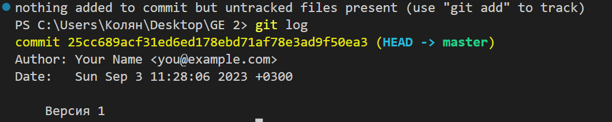
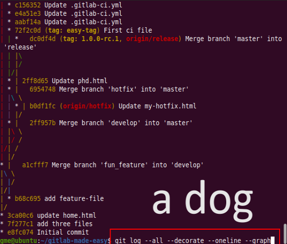
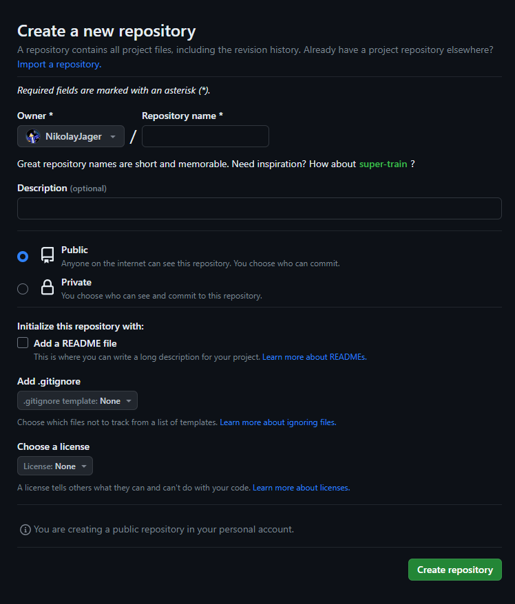
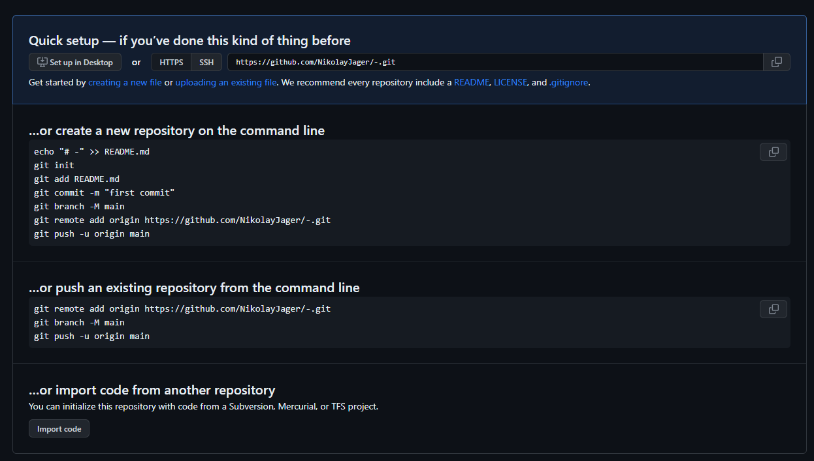
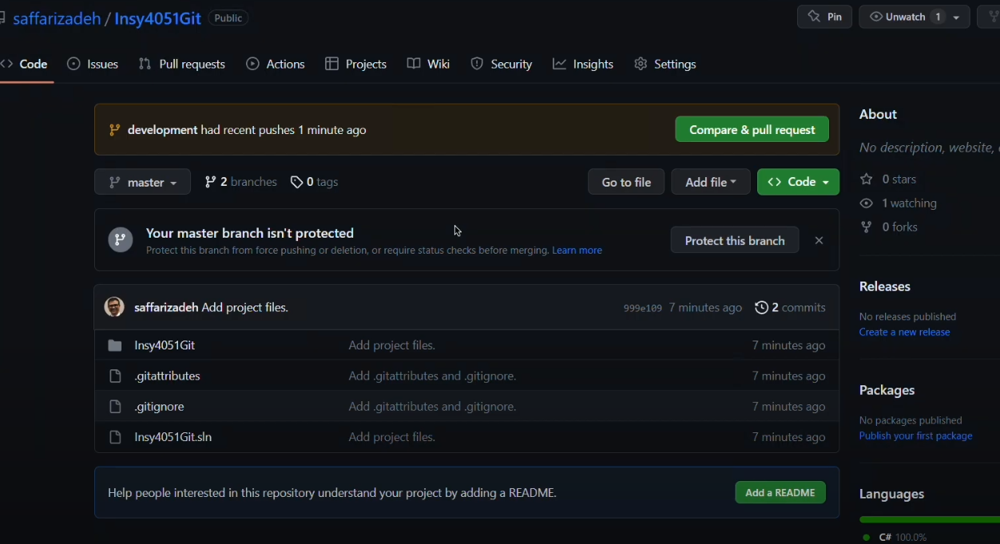

# Краткое руководство по Git
## Начало
Git - распределённая система управления версиями. Проект был создан Линусом Торвальдсом для управления разработкой ядра Linux, первая версия выпущена 7 апреля 2005 года.
Git получился спонтанно, Создатель Git'a сделал его чтобы создать операционную систему Linux.
Давайте скачаем данную программу: [*тык*](https://git-scm.com)
Затем надо нажать на кнопку скачивания которая находится в мониторе. То что у вас может отличаться версия, это нормально.

Далее надо несколько раз кликнуть по скаченному файлу и установить его. Готово!
заходим в VSC и вписываем в Терминал *git --version*
если вам вывелось что-то на подобии *git version 2.42.0.windows.2*, то это значит что все готово.
## Основные команды 
* git init - создает репозиторий
* git status - показывает информацию о репозитории
* git diff - показывает разницу
* git log - выводит логи репозитория и номер каждой версии каждого файла

* git log --graph - выводит логи, **НО** добавляется графика к логам

clear - очищает терминал
## Работа с версиями
* git add file_name.extension - добавляет актуальную версию file_name.extension в логи, где file_name - название, а extension - расширение
> После этой команды надо написать следующую команду:
> git commit -m "Описание Версии". 

* git checkout number - переход на какую либо версию файла репозитория, где number - номер версии

## Ветки
* git branch - показывает какие ветки есть и на какой ветке вы находитесь
* git branch branch_name - создается новая ветка с именем branch_name
* git branch -d branch_name - удаляет ветку branch_name
* git checkout branch_name - переход на ветку branch_name
* git merge branch_name - слияние ветки на которой вы находитесь с веткой branch_name

## GitHub
GitHub - крупнейший веб-сервис для хостинга IT-проектов и их совместной разработки. Программисты используют этот сервис для передачи своих кодов, а также выкладывать открытый, исходный код от какого либо приложения.

Есть 3 способа выложить свой файл на GitHub. Но давайте по порядку. Для того чтобы создать новый репозиторий надо нажать на эту кнопку справо вверху:

Затем, надо написать название репозитория, описание(по желанию), публичный ваш проект или нет и нажать на кнопку "Create repository". Готово!

И вот то нас встречают 3 способа выложить свой проект.
1. Создать репозиторий вместе с привязкой проект
2. Уже с созданным репозиторием привязать проект
3. Импортировать код из другого репозитория
Если выбрали 1 или 2 вариант то пропишите все строки ниже по порядку в зависимости от того, какой у вас вариант

**Готово!**
Теперь краткий курс по командам
* git push - позволяет отправить с вашего ПК в проект на гитхабе, изменения сделанные в вашем IDLE.
* git pull - это наоборот, с Гитхаба на ваш ПК перенести проект
* git clone "ссылка" - позволяет скопировать проект
Это самая основа, если вы хотите помочь какому-либо проекту который вы видите на Гитхабе то нажмите справо-вверху на кнопку "fork"

Далее выбираете название вашего форка и создаете, далее используя выше перечисленные команды и ваш скилл программирования и добавьте в ваш форк на гитхабе изменения, далее нажмите на кнопку "Compare & pull request"

И автор примет решение, принимать ваши изменения или же нет.
